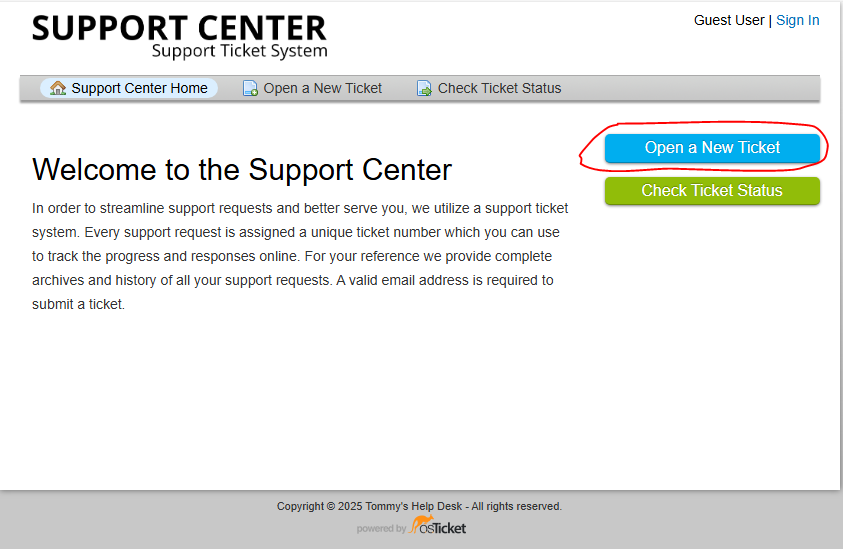
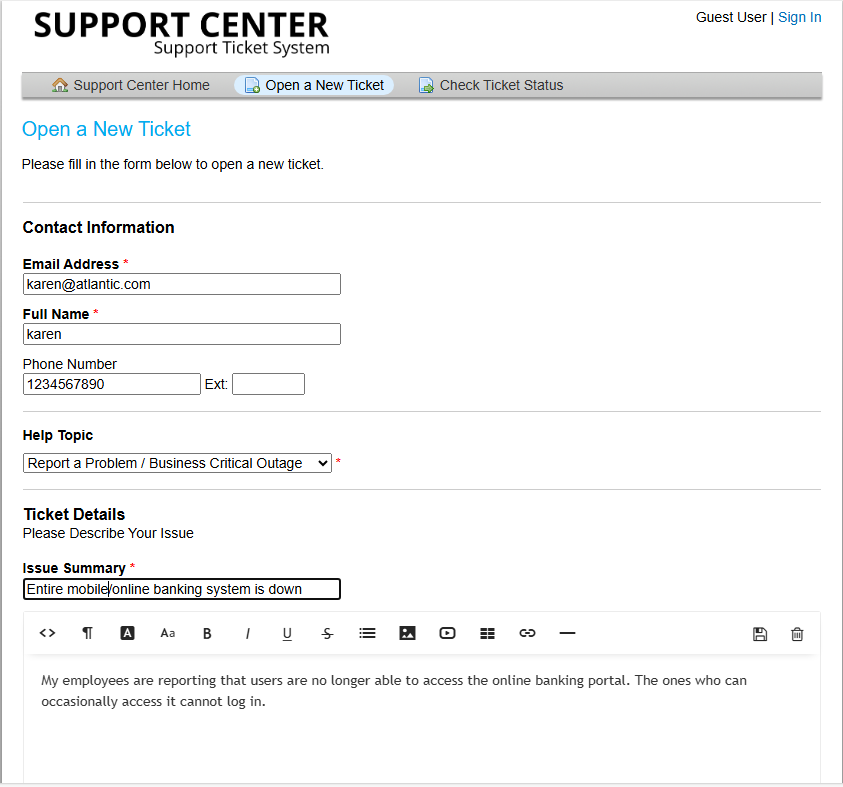
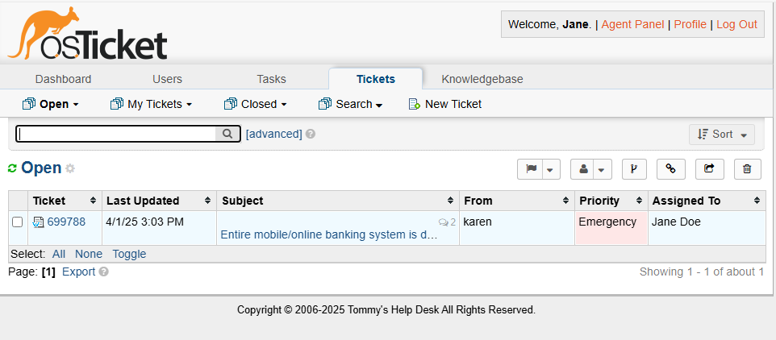
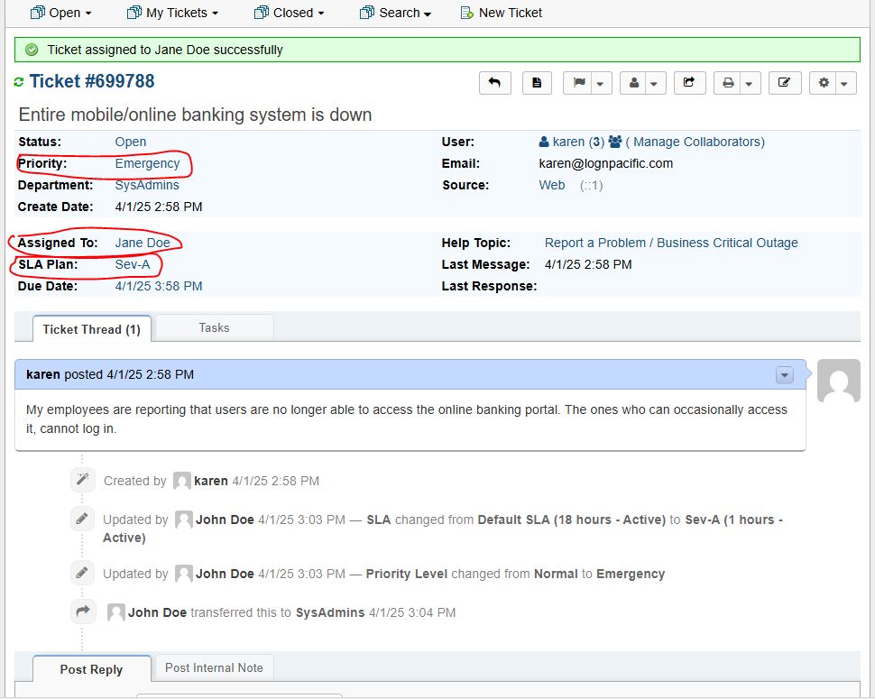
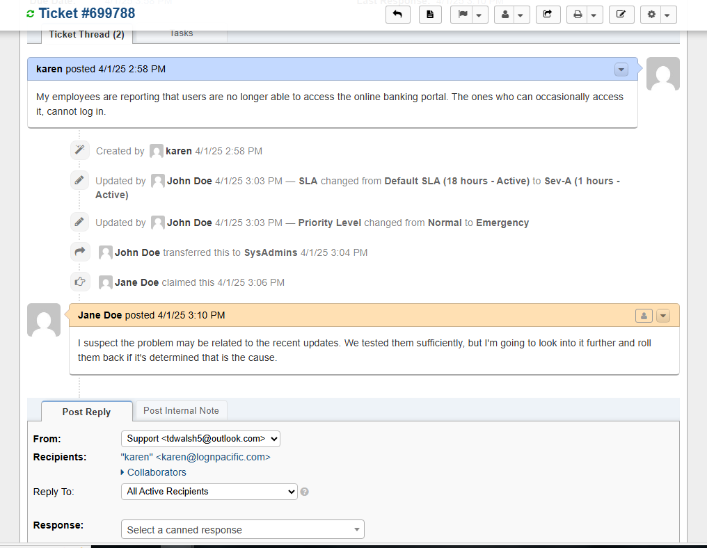
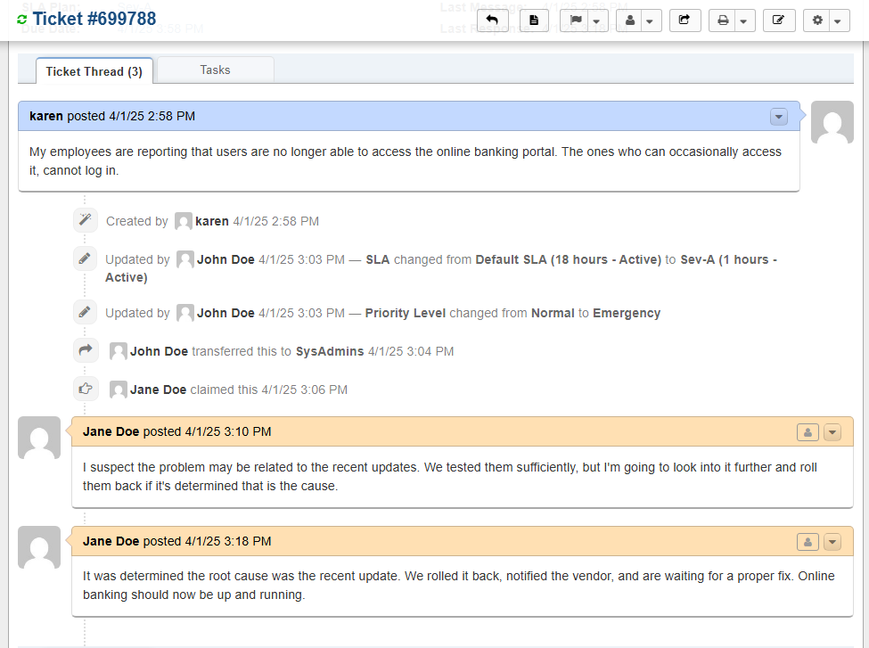
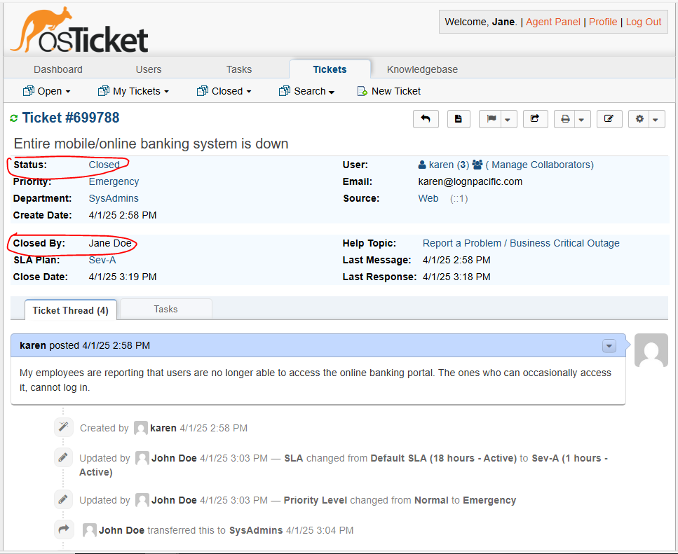

<h1>osTicket - Ticket Lifecycle: Intake Through Resolution</h1>
This tutorial outlines the lifecycle of a ticket from intake to resolution within the open-source help desk ticketing system osTicket. 

<h2>Environments and Technologies Used</h2>

- Microsoft Azure (Virtual Machines/Compute)
- Remote Desktop
- Internet Information Services (IIS)

<h2>Operating Systems Used </h2>

- Windows 10</b> (21H2)

<h2>Ticket Lifecycle Stages</h2>

- Intake
- Assignment and Communication
- Working the Issue
- Resolution

<h2>Lifecycle Stages</h2>

Karen a costumer of ours, is opening a new ticket in the Ticketing system. She files it under one of the help topics we created "Report a problem / Business Criticial Outage." The issue reported is that the entire online banking system is down.

 

First we will log in as John who is the Queue manager. Queue managers will priority tickets to the appropriate departments and ensure correct SLAs are applied. Next as the agent, we now log in as Jane who we gave a "Supreme Admin" role, we can view live tickets in the Agent Panel. 

 

The proper SLA, priority level, and assignment of the ticket has taken place. The communication between the customer and the agent has begun, and the agent is now working on resolving the issue.

 

The issue was determined and the online banking is now back up and running. The status is set to closed, and communication with the customer that the online banking should be back up and running has been made. 

 
